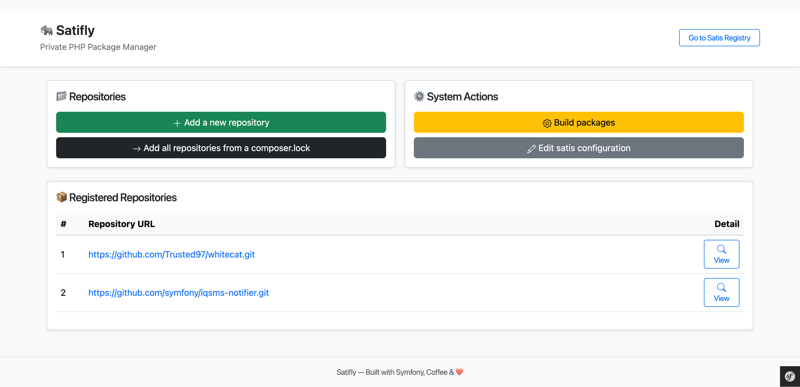

# Satifly — The Next-Generation Private PHP Package Registry


[](https://qlty.sh/gh/Trusted97/projects/satifly)

**Satifly** is the easiest and fastest way to host and manage your private Composer packages. Built for modern PHP developers, it combines the power of [Satis](https://getcomposer.org/doc/articles/handling-private-packages-with-satis.md) with the performance of [FrankenPHP](https://frankenphp.dev) and the reliability of [Caddy](https://caddyserver.com/) — all wrapped in a clean, production-ready Docker environment.



- - -

## 💡 Why Satifly?

Managing private Composer packages doesn’t have to be painful. Satifly eliminates manual configuration, provides a beautiful web UI, and automates your build and deployment process — securely and efficiently.

*   🌐 **Full-featured web dashboard** — manage `satis.json` visually
*   🔐 **Authentication** — protect your internal registry with ease
*   ⚡ **FrankenPHP-powered performance** — fast, concurrent builds out of the box
*   🐳 **Zero-effort Docker stack** — ready to run in seconds
*   🔄 **[VCS webhooks](docs/webhook.md)** — automatic package rebuilds on push
*   🚀 **HTTP/3 + Early Hints** — next-gen web delivery built-in

Satifly builds upon the excellent work of [project-satisfy/satisfy](https://github.com/project-satisfy/satisfy), extending it with cutting-edge tooling and developer-first improvements.

- - -

## 🚀 Get Started in Minutes

1.  Install [Docker Compose](https://docs.docker.com/compose/install/) (v2.10+)
2.  Clone and enter the repository:

```
git clone https://github.com/Trusted97/satifly
cd satifly
```

3.  Build and launch Satifly:

```
make build
make up
make doctor
```

4.  Open [https://localhost](https://localhost) and enjoy your private PHP registry.
5.  Stop everything when you’re done:

```
make down
```

👉 Want advanced Docker, Composer, or Xdebug workflows? Refer to the [Makefile documentation](docs/makefile.md) for advanced commands.

- - -

## ⚙️ Configure It Your Way

### 📁 Manage Your Packages

Use your existing `satis.json` or generate one instantly:

```
make satis-init
```

Prefer a visual experience? Configure everything directly via the web UI at `/admin/configuration`.

> 📚 For more details on how Satis works (configuration examples, usage, and authentication), refer to the official Composer documentation: [Using Satis](https://composer.github.io/satis/using)

### 🔧 Application Settings

Tune Satifly’s behavior in `app/config/parameters.yml`.

Example: enable admin authentication

```yaml
admin:
  auth: true
  users:
    - { username: admin, password: secret }
```

### 💻 Manual Setup (Optional)

Not a Docker fan? Install manually with Composer:

```
git clone https://github.com/Trusted97/satisfy
wget http://getcomposer.org/composer.phar
php composer.phar install -n
```

- - -

## 🧱 Running Satifly

Your Satifly instance serves the web UI from the `public` directory. Access `/admin` to manage repositories and configuration.

Build package definitions anytime with:

```
make satis-build
```

- - -

## ⚡ Core Advantages

*   ✅ **Production-grade by design** — secure, scalable, and battle-tested
*   🐘 **Built with Symfony 6.4 & PHP 8.4** — modern, reliable foundation
*   🚀 **FrankenPHP worker mode** — ultra-fast and memory efficient
*   🔒 **Automatic HTTPS** with Caddy
*   🧩 **Extensible architecture** — customize for your organization
*   👨‍💻 **Dev, CI, and production ready** out of the box

- - -

## 📄 License

Satifly is open source and distributed under the **MIT License**. For details, see the `LICENSE` file.

- - -

## 🤝 Contribute

We welcome contributions from developers and organizations! Whether it’s improving documentation, adding integrations, or refining the UI, your input helps Satifly grow.

Fork the project on [GitHub](https://github.com/Trusted97/satifly), open a pull request, and join the mission to simplify PHP package management.
