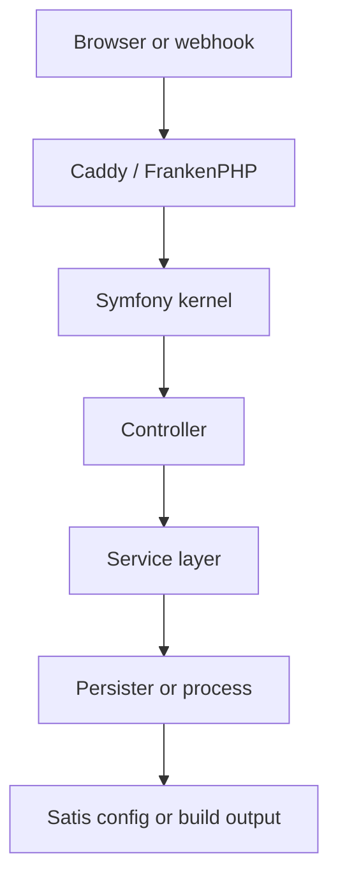
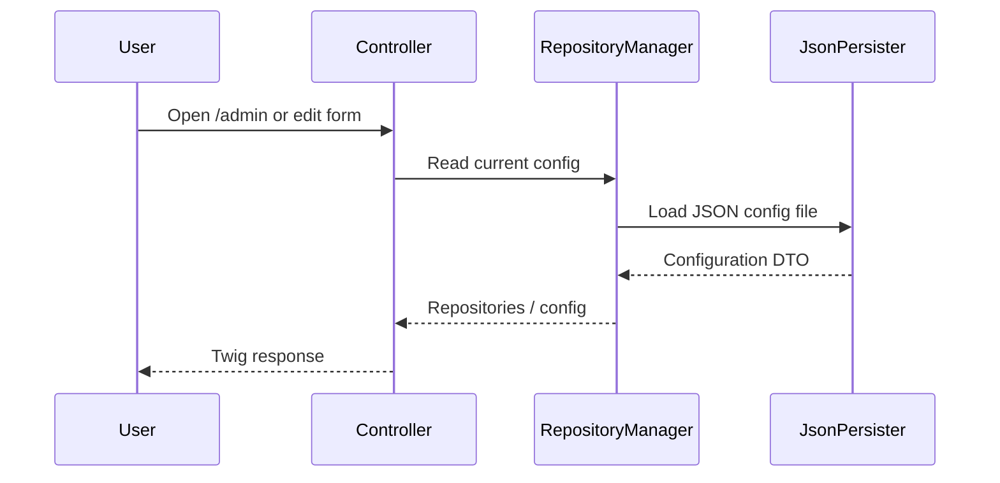
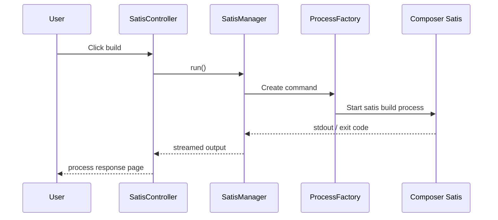
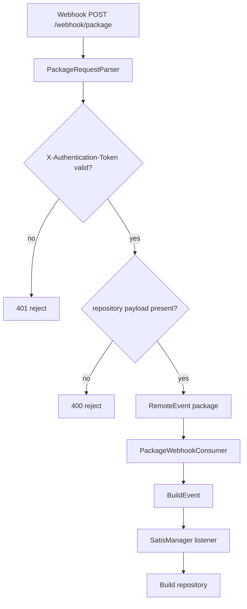

# Architecture Overview

Satifly is a file-based Symfony app around Satis. No database. No queue. No frontend build pipeline. That is on purpose.

## What App Does

- Stores Satis config in JSON file.
- Lets admin users edit repositories in web UI.
- Imports repository URLs from `composer.lock`.
- Triggers Satis builds through a Symfony command and build listener.
- Accepts webhook events for repository updates.

## Project Shape

| Area                    | Main code                                    |
|-------------------------|----------------------------------------------|
| Admin UI                | `src/Controller/AdminController.php`         |
| Satis UI and build page | `src/Controller/SatisController.php`         |
| Auth                    | `src/Controller/SecurityController.php`      |
| File config             | `src/Persister/FilePersister.php`            |
| JSON serialization      | `src/Persister/JsonPersister.php`            |
| Repository logic        | `src/Service/RepositoryManager.php`          |
| Satis build flow        | `src/Service/SatisManager.php`               |
| Lock import             | `src/Service/LockProcessor.php`              |
| Build event             | `src/Event/BuildEvent.php`                   |
| Webhook consumer        | `src/RemoteEvent/PackageWebhookConsumer.php` |

## Request Lifecycle

## Main Flows

### Admin UI Flow

### Build Flow

### Webhook Flow

## Why This Shape

- File storage keeps setup simple and portable.
- Symfony services keep behavior testable.
- Event-driven build flow decouples UI actions from build execution.
- Locking prevents concurrent config writes and concurrent builds.

## Configuration Flow

1. Environment vars load from `.env` or Docker.
2. Symfony parameters resolve `SATIS_CONFIG`, `SATIS_LOG`, `COMPOSER_HOME`, and `COMPOSER_CACHE`.
3. `RepositoryManager` loads JSON config through `JsonPersister`.
4. `Configuration` DTO holds repository state.
5. `JsonPersister` serializes back to Satis JSON format.

## Build Input And Output

- Input config file: `SATIS_CONFIG`
- Output directory: `Configuration::outputDir`
- Build command: `composer/satis build`
- Optional per-repository build: build listener passes repository name to Satis

## Related Docs

- [Developer guide](../development/guide.md)
- [Docker guide](../docker/overview.md)
- [Testing guide](../testing/guide.md)
- [Webhook API](../api/webhook.md)
